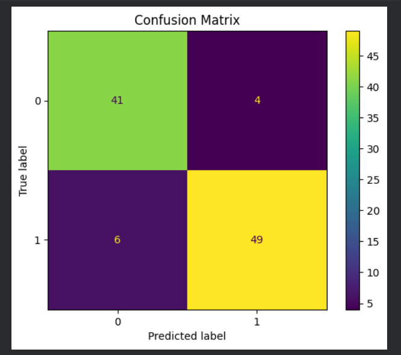
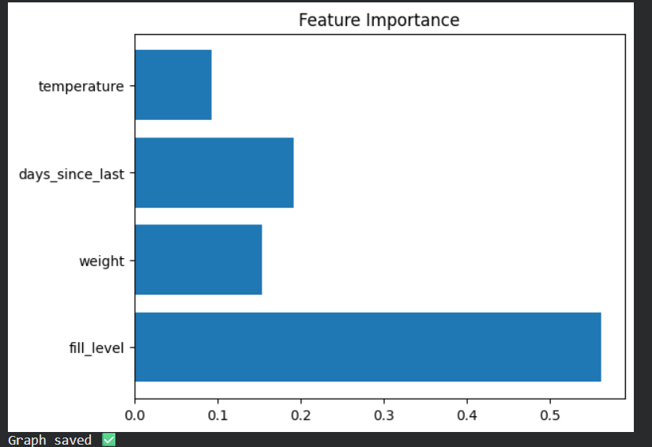
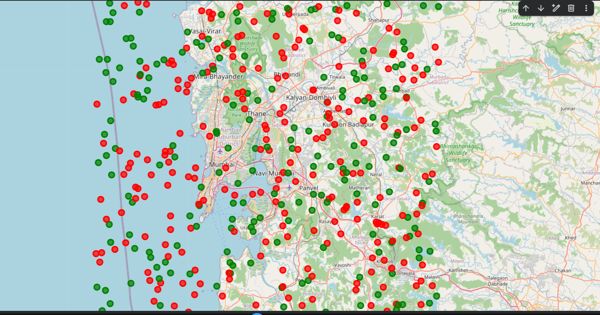

# 🚛 Smart Waste Collection Optimization

## 📌 Overview
This project uses **Machine Learning (Random Forest Classifier)** to predict whether a waste bin needs collection and optimize waste collection decisions.

---

## 🎯 Problem Statement
Traditional waste collection:
- Fixed schedules ❌
- Waste fuel and time ❌
- No real-time intelligence ❌  

👉 This project introduces **smart, data-driven waste management**

---

## 🧠 Solution
- Predict bin status using ML  
- Prioritize bins based on urgency  
- Visualize bins on map  

---

## ⚙️ Tech Stack
- Python  
- Scikit-learn  
- Pandas, NumPy  
- Matplotlib, Seaborn  
- Folium  

---

## 📊 Model Performance
- Accuracy: **85–90%**
- Uses realistic probabilistic data  

---

## 📌 Confusion Matrix


---

## 📌 Feature Importance


---

## 🗺️ Map Visualization


---

## 🔍 Features
- Predicts bin status  
- Confusion matrix evaluation  
- Feature importance analysis  
- Priority-based system  
- Map visualization  

---

## ▶️ How to Run
```bash
pip install -r requirements.txt
python src/train.py
python src/predict.py
